# Phase 1 Architecture Baseline

This document restates the currently implemented Real Capita ERP system as the Phase 1 starting scope for software design and planning.

Source of truth used for this baseline:

- `AGENTS.md`
- `docs/handoffs/foundation-status.md`
- `docs/handoffs/prompt-4-status.md` through `docs/handoffs/prompt-25-status.md`
- `packages/config/src/access.ts`
- `prisma/schema.prisma`

## Primary Actors

- Company Administrator
- Company Accountant
- Company Sales
- Company HR
- Company Payroll
- Company Member
- MinIO / S3-compatible object storage

## Functional Requirements

1. The system shall support authenticated browser access with login, refresh-token rotation, logout, and explicit active-company selection when a user belongs to more than one company.
2. The system shall enforce company-scoped role-based access using the Phase 1 roles `company_admin`, `company_accountant`, `company_sales`, `company_hr`, `company_payroll`, and `company_member`.
3. The system shall let Company Administrators manage companies, locations, departments, company users, and company-scoped role assignments.
4. The system shall provide an accounting core with company-scoped chart-of-accounts management across account classes, account groups, ledger accounts, and particular accounts.
5. The system shall provide a voucher engine that supports draft voucher creation, draft editing, voucher-line maintenance, and explicit posting of balanced vouchers only.
6. The system shall provide read-only financial reporting for trial balance, general ledger, profit and loss, and balance sheet using posted vouchers as the reporting source of truth.
7. The system shall provide project and property master-data management for projects, cost centers, project phases, blocks, zones, unit types, fixed unit statuses, and units.
8. The system shall provide CRM and property-desk operations for customers, leads, bookings, sale contracts, installment schedules, and voucher-linked collections.
9. The system shall provide HR operations for employees, attendance devices, device-user mappings, attendance logs, leave types, and leave-request lifecycle actions.
10. The system shall provide payroll operations for salary structures, payroll runs, payroll run lines, payroll run finalization/cancellation, and explicit payroll posting into accounting.
11. The system shall provide attachment and audit capabilities, including secure upload intent creation, direct browser upload to object storage, upload finalization, entity linking, secure download URL generation, soft archive actions, and audit-event browsing.
12. The system shall provide an operational dashboard that aggregates existing REST endpoints into company-aware summary panels, recent activity, pending-work cards, and quick-action navigation.
13. The system shall expose paginated, searchable, sortable, and filterable list views across operational modules where those capabilities are implemented in the current backend and frontend contracts.
14. The system shall keep the frontend role-aware by hiding inaccessible module navigation and rendering a clear forbidden state for authenticated but unauthorized route access.
15. The system shall provide Phase 1 output support through CSV export on the documented finance, voucher-detail, and selected operational list surfaces, plus browser-native print-friendly rendering for the documented finance and voucher-detail pages.
16. The system shall provide operator-run PostgreSQL backup, backup verification, destructive restore with explicit confirmation, non-mutating restore dry-run, and environment-safety check helpers for the Docker Compose baseline.

## Non-Functional Requirements

1. The system shall remain a locked-stack Nx + pnpm monorepo with `apps/web` as a Next.js App Router frontend-only client and `apps/api` as the only NestJS REST backend entry point.
2. The system shall preserve a strict REST-only boundary between web and API and shall not use Next.js server actions or Next.js backend routes for ERP business operations.
3. The system shall use Prisma and PostgreSQL 15 as the default persistence mechanism for CRUD, migrations, and generated types, while limiting raw SQL to complex reporting and transaction-enforcement flows already justified by the design.
4. The system shall enforce company isolation and same-company linkage through database constraints, composite keys, guards, and service validation.
5. The system shall enforce critical business integrity in PostgreSQL for accounting, booking/contract state changes, leave lifecycle, and payroll posting rather than relying only on UI validation.
6. The system shall keep browser authentication secure through short-lived access tokens, rotating refresh tokens, family-wide refresh revocation, httpOnly cookies, and explicit `401` versus `403` failure behavior.
7. The system shall preserve the canonical browser/runtime origin rules: `http://localhost:3000` as the local browser origin, same-host validation across `WEB_APP_URL`, `API_BASE_URL`, and `CORS_ORIGIN`, and HTTPS for non-localhost production browser sessions.
8. The system shall support direct browser-to-storage document upload and download through presigned URLs, with `S3_PUBLIC_ENDPOINT` resolving to a browser-reachable address and without proxying file bytes through the web app.
9. The system shall remain production-minded for the approved single-VM target by using Docker Compose, runner-style app containers, health checks, and explicit repo-root maintenance commands for migrate, bootstrap, and runtime smoke.
10. The system shall remain observable and supportable through request IDs, structured API errors, Swagger documentation, audit events, health/readiness endpoints, and container logs.
11. The system shall remain quality-gated through lint, typecheck, build, backend tests, Playwright e2e coverage, and GitHub Actions CI that validates Compose boot plus runtime smoke.
12. The system shall avoid fake demo data, tutorial placeholders, and speculative business behavior that is not explicitly part of the approved Phase 1 scope.
13. The system shall keep database dumps, object-storage backups, and generated build-info artifacts out of version control.

## Explicit Phase 1 Out Of Scope

1. MFA, SSO, password reset, email verification, invites, and broader identity-governance workflows.
2. Approval engines, workflow orchestration engines, notifications, messaging, and public-facing portal features.
3. Export builders beyond the documented CSV surfaces, including Excel generation, server-side PDF rendering, payslips, bank payout exports, and report publishing pipelines.
4. Revenue-recognition automation, refund/cancellation/transfer workflows, and broader accounting closing workflows beyond current posted-voucher reporting.
5. OCR, virus scanning, e-signature, public sharing, and workflow-heavy document review features.
6. Fine-grained permission DSLs, policy-management UI, and a redesigned IAM subsystem beyond the shared Phase 1 access matrix.
7. Kubernetes, multi-node deployment orchestration, or third-party SaaS runtime dependencies beyond the approved single-VM Docker Compose baseline.
8. Generic analytics backends, data warehouses, or new business-operation modules outside the implemented Phase 1 domains.
9. Automated scheduled backup infrastructure and point-in-time recovery.

## Use-Case Diagrams

### Macro-Level System Use-Case Diagram

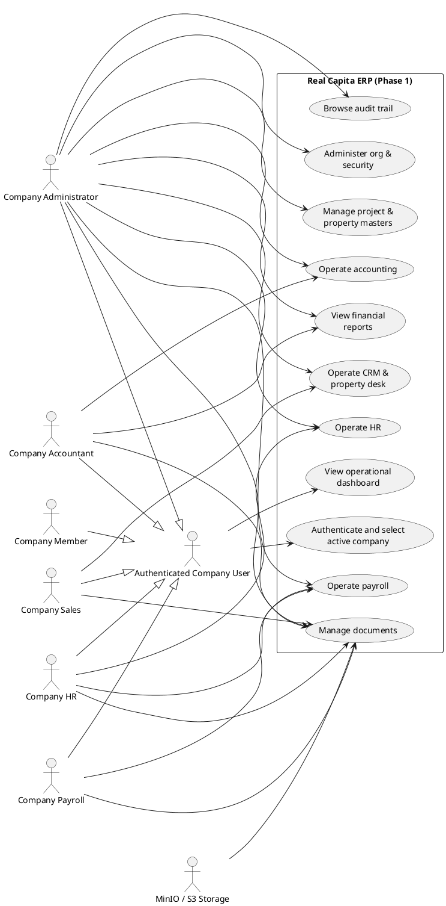

### Authentication & Session

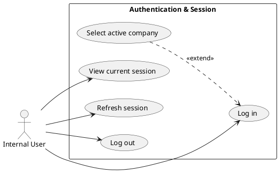

### Org & Security

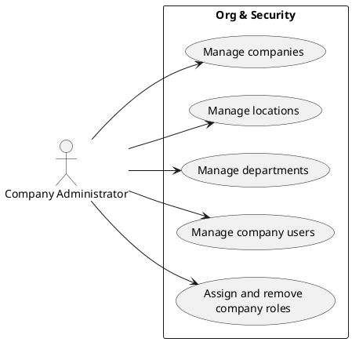

### Accounting Core

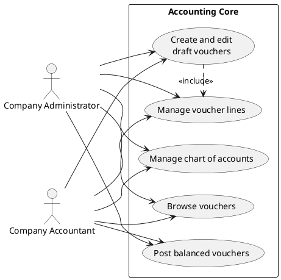

### Financial Reporting

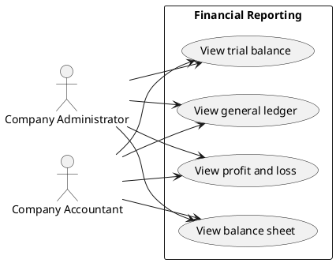

### Project & Property Master

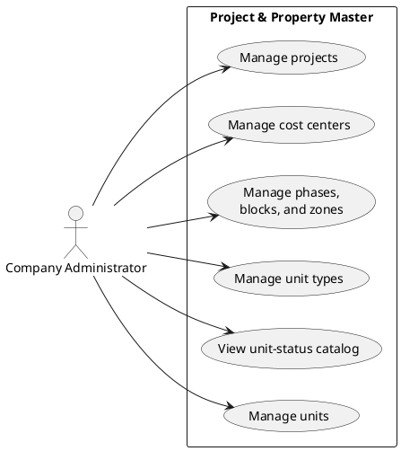

### CRM & Property Desk

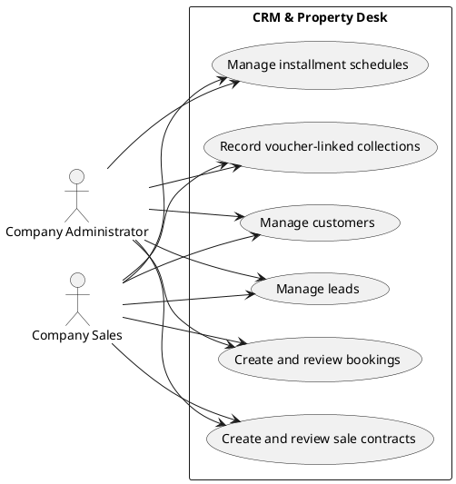

### HR Core

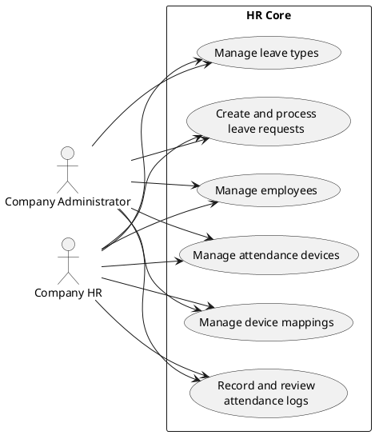

### Payroll Core

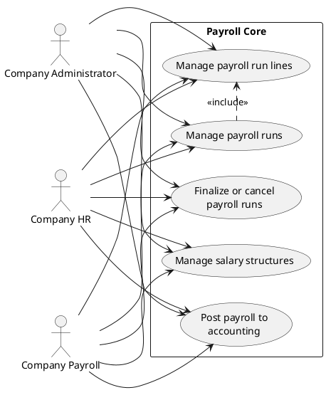

### Audit & Documents

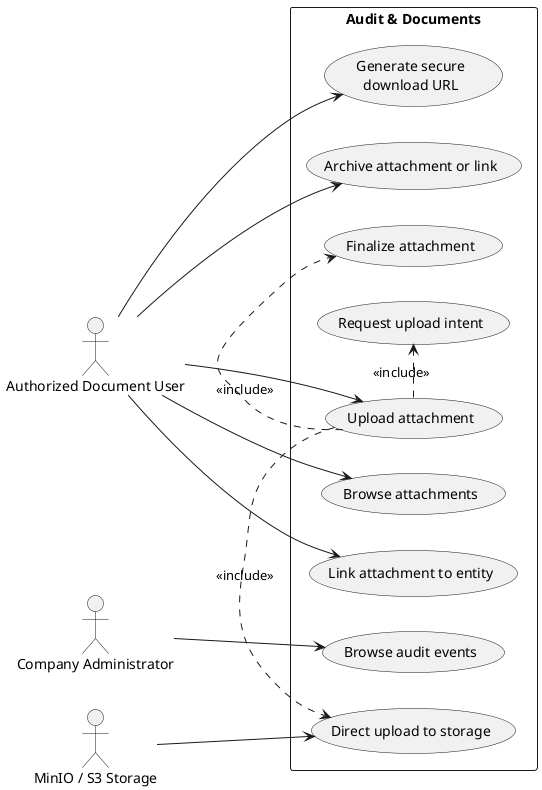

### Operational Dashboard

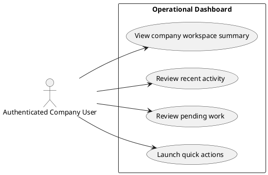

## Database ERD

Notes:

- This ERD is derived from `prisma/schema.prisma`.
- Company-scoped composite keys and unique indexes are simplified to PK/FK notation for readability.
- `ATTACHMENT_LINK.entityType + entityId` and `AUDIT_EVENT.targetEntityType + targetEntityId` are polymorphic company-scoped references, not hard database foreign keys to each business table.

```mermaid
erDiagram
    %% Core security
    COMPANY {
        uuid id PK
        string slug
        string name
        boolean isActive
    }
    ROLE {
        uuid id PK
        string code
        string name
        boolean isActive
    }
    USER {
        uuid id PK
        string email
        string firstName
        string lastName
        boolean isActive
    }
    USER_ROLE {
        uuid id PK
        uuid userId FK
        uuid companyId FK
        uuid roleId FK
        boolean isActive
    }
    REFRESH_TOKEN {
        uuid id PK
        uuid userId FK
        uuid companyId FK
        uuid tokenId
        uuid familyId
        datetime expiresAt
        datetime revokedAt
    }

    %% Org
    LOCATION {
        uuid id PK
        uuid companyId FK
        string code
        string name
        boolean isActive
    }
    DEPARTMENT {
        uuid id PK
        uuid companyId FK
        string code
        string name
        boolean isActive
    }

    %% Accounting
    ACCOUNT_CLASS {
        uuid id PK
        string code
        string name
        string naturalBalance
    }
    ACCOUNT_GROUP {
        uuid id PK
        uuid companyId FK
        uuid accountClassId FK
        string code
        string name
        boolean isActive
    }
    LEDGER_ACCOUNT {
        uuid id PK
        uuid companyId FK
        uuid accountGroupId FK
        string code
        string name
        boolean isActive
    }
    PARTICULAR_ACCOUNT {
        uuid id PK
        uuid companyId FK
        uuid ledgerAccountId FK
        string code
        string name
        boolean isActive
    }
    VOUCHER {
        uuid id PK
        uuid companyId FK
        uuid createdById FK
        uuid postedById FK
        string voucherType
        string status
        date voucherDate
    }
    VOUCHER_LINE {
        uuid id PK
        uuid voucherId FK
        uuid particularAccountId FK
        int lineNumber
        decimal debitAmount
        decimal creditAmount
    }

    %% Project and property
    PROJECT {
        uuid id PK
        uuid companyId FK
        uuid locationId FK
        string code
        string name
        boolean isActive
    }
    COST_CENTER {
        uuid id PK
        uuid companyId FK
        uuid projectId FK
        string code
        string name
        boolean isActive
    }
    PROJECT_PHASE {
        uuid id PK
        uuid projectId FK
        string code
        string name
        boolean isActive
    }
    BLOCK {
        uuid id PK
        uuid projectId FK
        uuid phaseId FK
        string code
        string name
        boolean isActive
    }
    ZONE {
        uuid id PK
        uuid projectId FK
        uuid blockId FK
        string code
        string name
        boolean isActive
    }
    UNIT_TYPE {
        uuid id PK
        uuid companyId FK
        string code
        string name
        boolean isActive
    }
    UNIT_STATUS {
        uuid id PK
        string code
        string name
        int sortOrder
    }
    UNIT {
        uuid id PK
        uuid projectId FK
        uuid phaseId FK
        uuid blockId FK
        uuid zoneId FK
        uuid unitTypeId FK
        uuid unitStatusId FK
        string code
        string name
        boolean isActive
    }

    %% CRM and property desk
    CUSTOMER {
        uuid id PK
        uuid companyId FK
        string fullName
        string email
        string phone
        boolean isActive
    }
    LEAD {
        uuid id PK
        uuid companyId FK
        uuid projectId FK
        string fullName
        string status
        boolean isActive
    }
    BOOKING {
        uuid id PK
        uuid companyId FK
        uuid projectId FK
        uuid customerId FK
        uuid unitId FK
        date bookingDate
        decimal bookingAmount
        string status
    }
    SALE_CONTRACT {
        uuid id PK
        uuid companyId FK
        uuid bookingId FK
        date contractDate
        decimal contractAmount
    }
    INSTALLMENT_SCHEDULE {
        uuid id PK
        uuid companyId FK
        uuid saleContractId FK
        int sequenceNumber
        date dueDate
        decimal amount
    }
    COLLECTION {
        uuid id PK
        uuid companyId FK
        uuid customerId FK
        uuid voucherId FK
        uuid bookingId FK
        uuid saleContractId FK
        uuid installmentScheduleId FK
        date collectionDate
        decimal amount
    }

    %% HR and payroll
    EMPLOYEE {
        uuid id PK
        uuid companyId FK
        uuid departmentId FK
        uuid locationId FK
        uuid userId FK
        uuid managerEmployeeId FK
        string employeeCode
        string fullName
        boolean isActive
    }
    ATTENDANCE_DEVICE {
        uuid id PK
        uuid companyId FK
        uuid locationId FK
        string code
        string name
        boolean isActive
    }
    DEVICE_USER {
        uuid id PK
        uuid companyId FK
        uuid employeeId FK
        uuid attendanceDeviceId FK
        string deviceEmployeeCode
        boolean isActive
    }
    ATTENDANCE_LOG {
        uuid id PK
        uuid companyId FK
        uuid deviceUserId FK
        datetime loggedAt
        string direction
        string externalLogId
    }
    LEAVE_TYPE {
        uuid id PK
        uuid companyId FK
        string code
        string name
        boolean isActive
    }
    LEAVE_REQUEST {
        uuid id PK
        uuid companyId FK
        uuid employeeId FK
        uuid leaveTypeId FK
        date startDate
        date endDate
        string status
    }
    SALARY_STRUCTURE {
        uuid id PK
        uuid companyId FK
        string code
        string name
        decimal netAmount
        boolean isActive
    }
    PAYROLL_RUN {
        uuid id PK
        uuid companyId FK
        uuid projectId FK
        uuid costCenterId FK
        uuid postedVoucherId FK
        int payrollYear
        int payrollMonth
        string status
    }
    PAYROLL_RUN_LINE {
        uuid id PK
        uuid companyId FK
        uuid payrollRunId FK
        uuid employeeId FK
        decimal basicAmount
        decimal netAmount
    }

    %% Documents and audit
    ATTACHMENT {
        uuid id PK
        uuid companyId FK
        uuid uploadedById FK
        uuid archivedById FK
        string status
        string storageBucket
        string storageKey
    }
    ATTACHMENT_LINK {
        uuid id PK
        uuid companyId FK
        uuid attachmentId FK
        uuid createdById FK
        uuid removedById FK
        string entityType
        uuid entityId
        boolean isActive
    }
    AUDIT_EVENT {
        uuid id PK
        uuid companyId FK
        uuid actorUserId FK
        string category
        string eventType
        string targetEntityType
        uuid targetEntityId
    }

    %% Core relationships
    COMPANY ||--o{ USER_ROLE : scopes
    ROLE ||--o{ USER_ROLE : grants
    USER ||--o{ USER_ROLE : receives
    COMPANY ||--o{ REFRESH_TOKEN : scopes
    USER ||--o{ REFRESH_TOKEN : owns

    %% Org relationships
    COMPANY ||--o{ LOCATION : has
    COMPANY ||--o{ DEPARTMENT : has

    %% Accounting relationships
    COMPANY ||--o{ ACCOUNT_GROUP : owns
    COMPANY ||--o{ LEDGER_ACCOUNT : owns
    COMPANY ||--o{ PARTICULAR_ACCOUNT : owns
    COMPANY ||--o{ VOUCHER : owns
    ACCOUNT_CLASS ||--o{ ACCOUNT_GROUP : groups
    ACCOUNT_GROUP ||--o{ LEDGER_ACCOUNT : contains
    LEDGER_ACCOUNT ||--o{ PARTICULAR_ACCOUNT : contains
    PARTICULAR_ACCOUNT ||--o{ VOUCHER_LINE : posts_to
    VOUCHER ||--o{ VOUCHER_LINE : contains
    USER ||--o{ VOUCHER : creates
    USER o|--o{ VOUCHER : posts

    %% Project and property relationships
    COMPANY ||--o{ PROJECT : owns
    COMPANY ||--o{ COST_CENTER : owns
    COMPANY ||--o{ UNIT_TYPE : owns
    LOCATION o|--o{ PROJECT : hosts
    PROJECT o|--o{ COST_CENTER : scopes
    PROJECT ||--o{ PROJECT_PHASE : has
    PROJECT ||--o{ BLOCK : has
    PROJECT ||--o{ ZONE : has
    PROJECT ||--o{ UNIT : contains
    PROJECT_PHASE o|--o{ BLOCK : optionally_scopes
    BLOCK o|--o{ ZONE : optionally_scopes
    PROJECT_PHASE o|--o{ UNIT : optionally_scopes
    BLOCK o|--o{ UNIT : optionally_scopes
    ZONE o|--o{ UNIT : optionally_scopes
    UNIT_TYPE ||--o{ UNIT : types
    UNIT_STATUS ||--o{ UNIT : statuses

    %% CRM relationships
    COMPANY ||--o{ CUSTOMER : owns
    COMPANY ||--o{ LEAD : owns
    COMPANY ||--o{ BOOKING : owns
    COMPANY ||--o{ SALE_CONTRACT : owns
    COMPANY ||--o{ INSTALLMENT_SCHEDULE : owns
    COMPANY ||--o{ COLLECTION : owns
    PROJECT o|--o{ LEAD : qualifies_for
    PROJECT ||--o{ BOOKING : sells_from
    CUSTOMER ||--o{ BOOKING : books
    UNIT ||--o{ BOOKING : reserves
    BOOKING ||--o| SALE_CONTRACT : converts_to
    SALE_CONTRACT ||--o{ INSTALLMENT_SCHEDULE : schedules
    CUSTOMER ||--o{ COLLECTION : pays
    VOUCHER o|--o| COLLECTION : backs
    BOOKING o|--o{ COLLECTION : relates_to
    SALE_CONTRACT o|--o{ COLLECTION : relates_to
    INSTALLMENT_SCHEDULE o|--o{ COLLECTION : settles

    %% HR and payroll relationships
    COMPANY ||--o{ EMPLOYEE : employs
    DEPARTMENT o|--o{ EMPLOYEE : organizes
    LOCATION o|--o{ EMPLOYEE : locates
    USER o|--o{ EMPLOYEE : optionally_links
    EMPLOYEE o|--o{ EMPLOYEE : manages
    COMPANY ||--o{ ATTENDANCE_DEVICE : owns
    LOCATION o|--o{ ATTENDANCE_DEVICE : installs
    COMPANY ||--o{ DEVICE_USER : owns
    EMPLOYEE ||--o{ DEVICE_USER : maps
    ATTENDANCE_DEVICE ||--o{ DEVICE_USER : maps
    COMPANY ||--o{ ATTENDANCE_LOG : owns
    DEVICE_USER ||--o{ ATTENDANCE_LOG : records
    COMPANY ||--o{ LEAVE_TYPE : owns
    COMPANY ||--o{ LEAVE_REQUEST : owns
    EMPLOYEE ||--o{ LEAVE_REQUEST : requests
    LEAVE_TYPE ||--o{ LEAVE_REQUEST : classifies
    COMPANY ||--o{ SALARY_STRUCTURE : owns
    COMPANY ||--o{ PAYROLL_RUN : owns
    COMPANY ||--o{ PAYROLL_RUN_LINE : owns
    PROJECT o|--o{ PAYROLL_RUN : scopes
    COST_CENTER o|--o{ PAYROLL_RUN : scopes
    VOUCHER o|--o| PAYROLL_RUN : posted_for
    PAYROLL_RUN ||--o{ PAYROLL_RUN_LINE : contains
    EMPLOYEE ||--o{ PAYROLL_RUN_LINE : paid_for

    %% Documents and audit relationships
    COMPANY ||--o{ ATTACHMENT : owns
    USER ||--o{ ATTACHMENT : uploads
    USER o|--o{ ATTACHMENT : archives
    COMPANY ||--o{ ATTACHMENT_LINK : scopes
    ATTACHMENT ||--o{ ATTACHMENT_LINK : links
    USER ||--o{ ATTACHMENT_LINK : creates
    USER o|--o{ ATTACHMENT_LINK : removes
    COMPANY ||--o{ AUDIT_EVENT : records
    USER o|--o{ AUDIT_EVENT : acts_in
```
